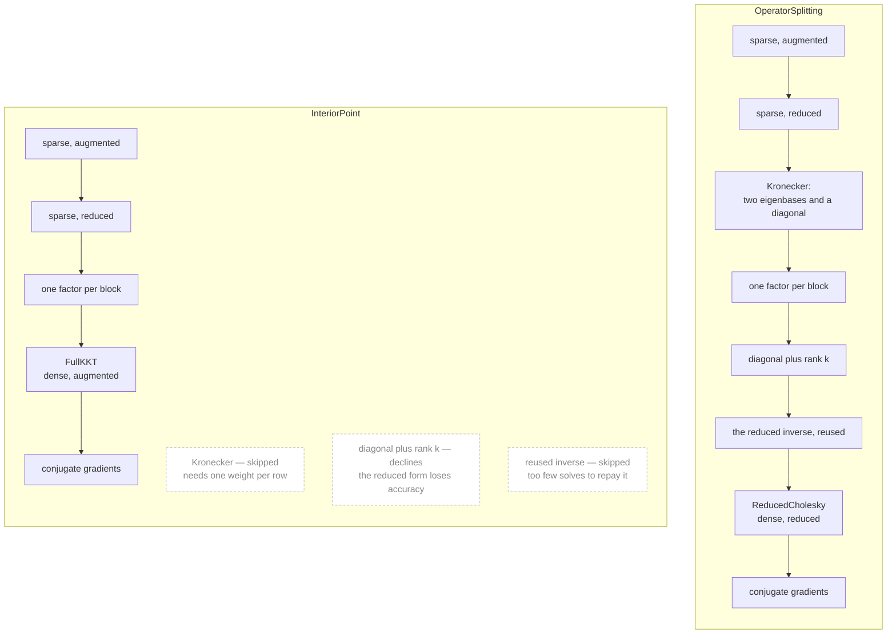

# How a backend is chosen

## What a backend is

Two of the three algorithms spend nearly all their time in one place: solving a linear system,
over and over, against a matrix built from `P`, `A` and a set of weights the algorithm updates
as it goes. Operator splitting does this once per iteration for hundreds or thousands of
iterations; the interior-point method does it a handful of times per iteration for ten or so.

This whole page is about those two. [`ActiveSet`](@ref) forms no such system: it reduces the
problem once and maintains its own `LDLᵀ` thereafter, so it has no backend to choose and
refuses any `linsys` but `:auto`.
Everything else — the vector updates, the projections, the residual tests — is `O(n + m)` and
costs almost nothing beside it.

A **backend** is one way of solving that system. It owns the decision of *which* matrix to
form, *how* to factor it, and *how* to apply the factorization to a right-hand side. A
[`LinearSystem`](@ref PureQPBase.LinearSystem) is that object: [`factorize!`](@ref
PureQPBase.factorize!) prepares it from the current data and weights, and
[`solve_system!`](@ref PureQPBase.solve_system!) answers one right-hand side with it.

## Why there is a choice to make

Because no single way is best for every problem, and the differences are large rather than
marginal.

A dense `P` and `A` are best served by forming an `n×n` matrix and inverting it once, so each
iteration is a single `symv`. A sparse pair is better factored sparsely, keeping the zeros.
A tridiagonal `P` with a diagonal `A` gives a tridiagonal system, solved in `O(n)` without
forming anything. `A₁ ⊗ A₂` has no zeros at all, so a sparse factorization has nothing to
skip — but handed over as its two factors it is solved through their eigenvectors, which is
[52× faster](@ref "Structured backends") on the benchmark here. An operator that supplies
only products cannot be factored at all and needs conjugate gradients.

Picking wrongly is not a rounding error. The same problem, solved through the wrong backend,
runs anywhere from a little slower to two orders of magnitude slower, and some pairs cannot
be served by some backends at all.

So the choice is made once, in `setup`, from what the caller asked for, what types `P` and
`A` are, and which algorithm is running. The backend then becomes part of the workspace's
type, so the per-iteration solve dispatches statically with no branch. The rest of this page
is how that decision is reached.

## You can make it yourself

The automatic choice is a default, not a policy. `linsys` names a backend outright, and
[`recommend_linsys`](@ref PureQPBase.recommend_linsys) measures instead of guessing:

```julia
setup(P, q, A, l, u, alg; linsys = :kkt)     # this backend, or an error saying why not
recommend_linsys(P, q, A, l, u)              # build each candidate, time a solve, rank them
```

`linsys` takes ten values, listed under [What each `linsys` value means](@ref). It is an
instruction rather than a hint: name one the pair cannot support and the call fails, naming the
condition it failed, rather than quietly using something else.

It is decided for you by default because the decision needs things a caller would otherwise
have to work out. Whether the reduced matrix fills in, and how many nonzeros the densest row
of `A` holds, are read from the sparsity pattern. The answer also depends on the algorithm
and not only on the matrices: the same `Diagonal` and `RowCoupled` pair is served by the
low-rank backend under operator splitting and declined under the interior-point method. And
the cost of choosing badly is large — up to two orders of magnitude — so a default that is
usually right beats a decision the caller is usually guessing at.

The automatic order is fitted to a benchmark suite, so it can misjudge a problem. That is
what `linsys` and `recommend_linsys` are for.

## The two systems

Both need the same solve, `(x, z)` from `(b_x, b_z)`, and there are two forms of it.

The **augmented** system keeps the constraints as rows:

```math
\begin{bmatrix} \tilde P + \sigma I & \tilde A^\top \\ \tilde A & -\operatorname{diag}(w)^{-1} \end{bmatrix}
\begin{bmatrix} x \\ \nu \end{bmatrix} =
\begin{bmatrix} b_x \\ b_z \end{bmatrix}
```

The **reduced** system eliminates them:

```math
\left( \tilde P + \sigma I + \tilde A^\top \operatorname{diag}(w) \tilde A \right) x = b_x + \tilde A^\top (w \odot b_z)
```

The reduced form is `n×n` rather than `(n+m)×(n+m)` and is what every structured backend
exploits, because structure in `P` and `A` survives into it. It has one cost: forming
`Ãᵀ diag(w) Ã` mixes the weights into the matrix. That is harmless while the weights stay in
a narrow band, and it is not harmless when they do not — which is the difference between the
two algorithms below.

## What each `linsys` value means

The ten values split into two groups, and they answer different questions.

**Four name a solver.** They say which of the two systems above gets built, and what solves it.
They say nothing about your matrices:

| value | system it builds | what solves it |
|---|---|---|
| `:dense` | reduced, `n×n` | a dense Cholesky, inverted in place, so each solve is one `symv` |
| `:kkt` | augmented, `(n+m)×(n+m)` | a dense `bunchkaufman!` |
| `:sparse` | augmented or reduced, whichever fits the pattern | a sparse `LDLᵀ` or Cholesky |
| `:indirect` | neither — nothing is ever built | preconditioned conjugate gradients, through products alone |

What each one asks of you:

| value | requires | pick it when |
|---|---|---|
| `:dense` | `P` and `A` you can materialize | the pattern rule misjudged your problem and you want the dense reduced path anyway |
| `:kkt` | `P` and `A` you can materialize | the reduced form's conditioning is in doubt; it never squares `cond(A)` |
| `:sparse` | `SparseMatrixCSC` `P` and `A`, and `using SparseArrays` | you want a sparse factorization on a pair `:auto` sends elsewhere |
| `:indirect` | `using Krylov`. Under [`InteriorPoint`](@ref), also a `preconditioner` of your own and `scaling = 0` | the matrix cannot be formed at all, or forming an `n×n` inverse is the dominant cost |

`:kkt` and `:dense` always build. They test nothing about the pair beyond being able to
materialize it, which is what makes them the reliable escape hatches. `:sparse` tries the
augmented form first, then the reduced one, then the formed-and-inverted one, and refuses only
if none of the three factors.

**Five name a matrix structure**, not a solver: `:diagonal`, `:tridiagonal`, `:block`,
`:kronecker` and `:lowrank`. Each one asserts that your `P` and `A` have a particular shape, and
the solver follows from that shape — all five build the reduced system and exploit the structure
in it. Name one your pair does not have and the call fails, naming the shape it wanted.
[Matrix types](@ref "Structured operators the package ships") covers what each shape is and when
it pays.

## The decision

```text
setup(P, q, A, l, u, algorithm; linsys)
│
├── linsys names a backend ───► named_backend
│                               ├── the pair admits it ──────► build it
│                               └── it does not ─────────────► throw, naming the condition
│
└── linsys = :auto ───────────► choose_backend(P, A, prob, wt, selection)
                                ├── a method for this (P, A) ► that backend
                                │   pair exists                (Kronecker, banded, block, …)
                                └── none exists ─────────────► select_backend: work down the
                                                               list of candidates for this
                                                               algorithm, taking the first
                                                               that serves the pair
                        ▼
                    factorize!
                        ├── succeeds ───► this is the workspace's backend, and its type
                        │                 from here on
                        └── fails ──────► rebuild on FullKKT, or throw if that is what
                                          already failed
```

`linsys` is an instruction rather than a hint: a named backend that the pair does not admit
is refused with the condition it failed, not silently replaced. The one exception is the last
step — a factorization that fails is rebuilt on the full KKT system, which is the only
selection decision made after `setup` has already chosen.

## The order each algorithm tries

A pair with no `choose_backend` method of its own falls back to a fixed list of candidates.
Each candidate is a function that either builds a backend for the pair or declines, and
`select_backend` takes the first that does not decline. The two draw on the same candidates and
differ in which ones they consider, and in where they stop.



Each entry is reached only if the one before it declines. The dense entry is where any pair
that can be formed at all comes to rest; conjugate gradients sits after it, for an operator
that supplies products and no entries.

Three differences, and each comes from the weights.

**Kronecker is skipped under the interior-point method.** Diagonalizing `A₁ ⊗ A₂` needs one
weight for every row, and the interior-point weights differ from row to row from the first
iteration.

**The reused inverse is skipped.** It inverts the reduced matrix once and applies that inverse
thereafter, which pays over the hundreds of solves an operator-splitting run takes. An
interior-point run takes a handful of solves per factorization, so the inverse would be
rebuilt almost as often as it is used.

**Diagonal-plus-low-rank declines.** This is the reduced form's cost, arriving. An active row's weight
reaches `1/δ_d`, so the rank-`k` correction sits orders of magnitude above the diagonal core
it corrects and the small directions are rounded away as the matrix is formed. Measured
against a reference in extended precision, the reduced matrix reaches about `1e-8` where the
augmented factorization reaches `1e-15`; solving the reduced matrix through the Woodbury
identity rather than densely does not change that, because the loss happens when the matrix is
built (`PureIPM/bench/ipm_lowrank_terminal.jl`).

That is also why the last dense candidate differs: `ReducedCholesky` for operator splitting,
[`FullKKT`](@ref) for the interior-point method. The first reduces and the second does not.

## What the sparse candidates ask

The two sparse candidates do not decide for themselves. Both put one question to the sparsity
pattern — `sparse_form(P, A, n, m, selection)` — and act on its single answer:

```text
   the pattern of P and A ──► sparse_form ──┬── :kkt ─────► factor the augmented system
                                            │               sparsely
                                            ├── :reduced ─► factor the reduced system
                                            │               sparsely
                                            └── :none ────► decline, and the next
                                                            candidate is tried
```

The rule reads the pattern and nothing else — how many nonzeros the densest row of `A` holds,
and the sum of the squared row counts, which is what the reduced matrix's fill costs. Values
never enter it, so a problem's backend does not change when its numbers do, and `setup` can
factor once with the values the solve will use.

A row spanning every variable fills the reduced matrix by itself, so a pattern holding one
sends both to the augmented form. That is the shape of a budget constraint, and it
is why the OSQP suite's Portfolio class factors the `(n+m)` system.

`sparse_form` answers for `SparseMatrixCSC` pairs. A structured type that is not stored as CSC
never reaches it, and passes both sparse candidates to the ones that dispatch on its own
type.

## Asking what was chosen

```julia
ws = setup(P, q, A, l, u, OperatorSplitting())
backend_name(ws.linsys)      # :cholesky, :sparse_formed, :banded, ...
backend_info(ws.linsys)      # the form, its dimension, and what the factor stores
factor_fill(ws)              # that store, against n²
```

[`recommend_linsys`](@ref) goes further and measures: it builds every backend the pair admits,
runs a bounded number of iterations on each, and ranks them by the cost of a whole solve. The
order is fitted to a benchmark suite, and `recommend_linsys` is how a problem it misjudges
gets a second opinion.
